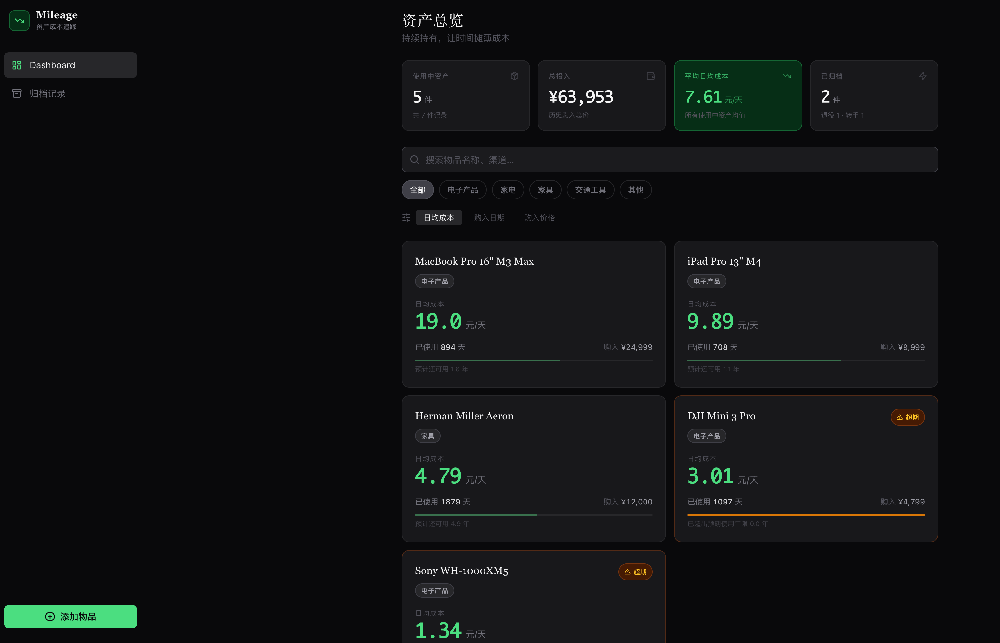

<div align="center">
  <h1>Mileage</h1>
  <p><strong>自托管的资产成本追踪器</strong></p>
  <p>把购入价格、维修维护、残值和持有时间折算成真实日均成本。</p>

  <p>
    <a href="LICENSE"></a>
    
    
    
  </p>

  
</div>

## 为什么做这个

很多东西买回来不是一次性消费。手机换过屏幕，电脑换过电池，耳机修过一次，最后可能还会转手。Mileage 关心的是这些物品在整个持有周期里到底花了多少钱。

它适合用来回答这些问题：

- 这件东西平均每天花了多少钱？
- 维修后继续用，还是换新更划算？
- 后续维修、保养、配件要不要算进总成本？
- 哪些资产已经到了该退役或转手的时候？

## 功能

- 记录电子产品、家电、家具、交通工具和其他大额物品
- 追踪购入价格、购入日期、渠道、备注和预估残值
- 支持使用中、已退役、已转手三种状态
- 记录维修、换电池、保养、配件、保修等后续支出
- 可选择每笔后续支出是否计入总拥有成本
- 自动计算日均成本、年化成本、总投入和归档统计
- 使用一个专属密码登录，适合个人自托管
- Docker Compose 一条命令部署

## 快速开始

准备一台已经安装 Docker 和 Docker Compose 的机器：

```bash
curl -fsSLO https://raw.githubusercontent.com/Moyuin-aka/Mileage/main/compose.release.yml
curl -fsSLO https://raw.githubusercontent.com/Moyuin-aka/Mileage/main/.env.example
cp .env.example .env
```

编辑 `.env`，至少修改这三项：

```bash
APP_PASSWORD=你的登录密码
API_TOKEN=一串足够长的随机密钥
POSTGRES_PASSWORD=一串足够长的数据库密码
```

可以用 OpenSSL 生成随机密钥：

```bash
openssl rand -hex 32
```

启动：

```bash
docker compose -f compose.release.yml up -d
```

默认访问：

```text
http://localhost:8088
```

部署在服务器上时，把 `localhost` 换成服务器地址即可。

## Docker 镜像

预构建镜像发布在 GitHub Container Registry：

```text
ghcr.io/moyuin-aka/mileage-api:0.1.0
ghcr.io/moyuin-aka/mileage-frontend:0.1.0
```

`compose.release.yml` 默认使用 `latest`。如果想固定版本，可以在 `.env` 中指定：

```bash
MILEAGE_API_IMAGE=ghcr.io/moyuin-aka/mileage-api:0.1.0
MILEAGE_FRONTEND_IMAGE=ghcr.io/moyuin-aka/mileage-frontend:0.1.0
```

## 升级

```bash
docker compose -f compose.release.yml pull
docker compose -f compose.release.yml up -d
```

数据库 migration 会在 API 启动时自动执行。数据保存在 Docker volume `pgdata` 中，升级前建议先备份。

## 备份

导出数据库：

```bash
docker compose -f compose.release.yml exec db pg_dump -U mileage mileage > mileage-backup.sql
```

恢复前请先停止服务，并确认目标数据库为空。

## 成本模型

Mileage 的核心公式：

```text
日均成本 = (购入价格 + 计入成本的后续支出 - 回收金额) / 持有天数
```

回收金额规则：

- 已转手物品使用转手价格
- 未转手物品使用预估残值

后续支出可以单独决定是否计入成本。比如换电池、修屏幕通常可以计入；免费保修或只想留档的记录可以不计入。

## 路线图

`0.1.0` 是第一个公开自托管版本，重点是资产记录、成本统计、后续支出和基础密码保护。

计划在 `1.0.0` 加入 OCR，让购买截图、订单截图或票据能自动辅助录入。

## 本地开发

```bash
cp .env.example .env
cd frontend && npm install && npm run build && cd ..
docker compose up --build
```

技术栈：

- React + TypeScript + Vite + Tailwind CSS
- Hono + TypeScript + PostgreSQL
- Docker Compose

## License

Mileage is licensed under the [GNU Affero General Public License v3.0](LICENSE).
